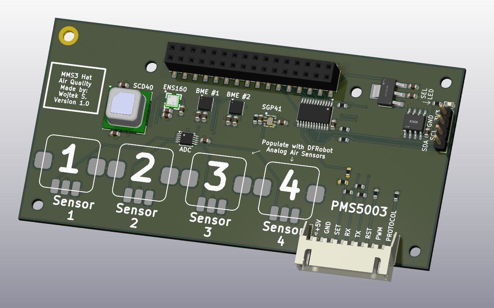

# MMS3 Hat Air Quality

## Sekcja 1: Dokumentacja Hat'a

### Krótki opis projektu
Hat Air Quality to hat z miejscami na różne czujniki jakości powietrza. Są to 2x BME688 (lub kompatybilne) oraz po jednym PMS5003 (lub kompatybline), SCD40-D-R2, SGP41-D-R4, ENS160-BGLM oraz 4x miejsca na analogowe czujniki DFRobot (np. DFRobot SEN0564).

Dzięki temu potrafi mierzyć temperature, wilgotność, ciśnienie, VOC, IAQ, PM, CO2, NOX oraz wielkości mierzone przez 4x czujniki DFRobot

### Zgodność ze standardem ChainBus

* ✅ Używa złącza ChainBus, nie zmienia jego miejsca ani pinoutu.
* ✅ Używa wyłącznie interfejsów I2C, SPI lub UART i nie inicjuje samodzielnie nowych transmisji (Nie jest master'em I2C albo SPI).
* ✅ Spełnia wymagania mechaniczne standardu (wymiary PCB, rozstaw otworów).
* ❌ Pobiera maksymalny prąd zgodny z ilością na jednego hat'a **-> normalna praca >125mA, potrzeba określić empirycznie**
* ✅ Obsługuje napięcie wejściowe BRD_VIN do wartości 48V.

### Komunikacja i adresowanie

#### Adresacja I2C

| Układ (IC)      | Funkcja                   | Address |
| :-------------- | :------------------------ | :-----: |
| **BME688 #1**   | Czujnik jakości powietrza | `0x76`  |
| **BME688 #2**   | Czujnik jakości powietrza | `0x77`  |
| **SCD40-D-R2**  | Czujnik jakości powietrza | `0x62`  |
| **SGP41-D-R4**  | Czujnik jakości powietrza | `0x59`  |
| **ENS160-BGLM** | Czujnik jakości powietrza | `0x52`  |
| **ADS1115IDGS** | Przetwornik ADC           | `0x48`  |

#### Magistrala SPI
Brak urządzeń, ale CS może być użyty do włączania/wyłączania PMS5003

#### Magistrala UART
UART jest podłączony bezpośrednio do PMS5003.

| Układ (IC)  | Funkcja                   | chainbus/multiplexer |
| :---------- | :------------------------ | :------------------: |
| **PMS5003** | Czujnik jakości powietrza |      `chainbus`      |

### Pinout złączy

| Jn       | Co                | Jaki pin co robi                                                                                                                                                                                                                                                                                                                                                                                          |
| :------- | :---------------- | :-------------------------------------------------------------------------------------------------------------------------------------------------------------------------------------------------------------------------------------------------------------------------------------------------------------------------------------------------------------------------------------------------------- |
| **J101** | Złącze do PMS5003 | **Pin 1: +5V**  **Pin 2: GND** **Pin 3: SET** – Wejście włączenia/uśpienia (Stan wysoki = normalna praca, Stan niski = tryb uśpienia) **Pin 4: RX Czujnika** **Pin 5: TX Czujnika**  **Pin 6: RST** – Reset modułu (aktywny stan niski - reset po podaniu GND) **Pin 7: PWM** – Wyjście sygnału PWM, NC  **Pin 8: PROTOCOL** – Wybór protokołu/trybu pracy czujnika. Ma pulldown 10k |

### Konfiguracja układu (Zworki/Rezystory)

| Co                   | Jak podłączone        | Efekt                                  |
| :------------------- | :-------------------- | :------------------------------------- |
| **R101, R102, R104** | Wlutowany R104        | Pin SET zawsze wysoki                  |
|                      | Wlutowany  R101, R102 | Pin SET podłączony do pinu CS ChainBus |

### Szczegółowy opis techniczny
Czujniki BME688, SCD40-D-R2, SGP41-D-R4, ENS160-BGLM są bezpośrednio podłączone do magistrali I2C.

Czujniki analogowe DFRobot są podłączone do przetwornika ADC ADS1115IDGS. Kanały przetwornika 0-3 są podłączone do czujników 1-4.

 Czujnik PMS5003 jest bezpośrednio
podłączony do magistrali UART. Jego pin SEL domyślnie jest podciągany do +3.3V przez rezystor R104 (10k), ale można go wylutować
i wlutować R101 R102. Wtedy pin SEL jest bezpośrednio podłączony do pinu CS chainbus oraz ściągany (weak pulldown) do 0V przez R101 (10k).
Jeśli nie potrzebujesz oszczędzać prądu to zalecane jest zostawienie wlutowanego R104.

### Gotowe arkusze hierarchiczne
Brak

---

## Sekcja 2: Specyfikacja standardu ChainBus

### Architektura i łączenie modułów
Standard ChainBus umożliwia modułowe łączenie hatów. Na jednym MMS3 można zamontować pionowo **do 8 hat'ów**. Połączenie realizowane jest poprzez wpięcie złącza męskiego kolejnego hat'a w złącze żeńskie poprzedniego

### Komunikacja i sterowanie
Magistrala ChainBus jest w pełni cyfrowa. Płyta główna nie steruje bezpośrednio sygnałami ogólnego przeznaczenia (GPIO) na poszczególnych hat'ach. Wszelkie operacje (np. obsługa diod LED, odczyt krańcówek, generowanie sygnałów PWM) muszą być realizowane przez dedykowane układy scalone (np. ekspandery portów, sterowniki) komunikujące się przez interfejsy systemowe.

*Przykład:*
`MCU` $\rightarrow$ `Expander GPIO po I2C` $\rightarrow$ `Dioda LED`

Wybór aktywnego modułu realizowany jest przez układ przełącznika magistrali (bus switch) na płycie głównej. Dzięki temu linie I2C, SPI i UART są niezależne dla każdego hat'a (brak konfliktów adresów I2C między różnymi hatami).
* **Identyfikacja:** Każdy moduł powinien posiadać pamięć EEPROM na magistrali I2C w celu identyfikacji płyty przez system - układ M24C64-W skonfigurowany na adres `1010000` przy liniach adresowych A0, A1, A2 zwartych do masy.

### Zasilanie
Złącze ChainBus dostarcza następujące linie zasilania:

| Magistrala zasilania | Napięcie znamionowe | Maksymalny prąd (łączny dla 8 hatów) | Szacowany prąd na jeden hat |
| :------------------- | :-----------------: | :----------------------------------: | :-------------------------: |
| **5V**               |        5.0 V        |                1.0 A                 |           125 mA            |
| **12V stby**         |       12.0 V        |                0.5 A                 |            65 mA            |
| **BRD_VIN**          |   12.0 V – 48.0 V   |                1.5 A                 |           185 mA            |

*   Komponenty podłączone do linii `BRD_VIN` muszą być przystosowane do pracy z napięciem od 12V do **48 V**.
*   W przypadku zapotrzebowania na wyższą moc, dopuszczalne jest zastosowanie dodatkowego złącza zasilania XT60 (obciążalność do ok. 60 A).

### Wymagania mechaniczne i złącza
* **Wymiary PCB:** Niedozwolona jest zmiana obrysu płytki oraz położenia otworów montażowych, aby zachować kompatybilność mechaniczną.
* **Pozycjonowanie złączy ChainBus:** Położenie złącza standardu 2x16 SMD (raster 2.54 mm) musi być zgodne z szablonem. Złącze żeńskie montowane jest na stronie FRONT, natomiast złącze męskie na stronie BACK.
* **Interfejsy zewnętrzne:** Złącza wejścia/wyjścia (domyślnie standard JST-XH 2.5 mm o obciążalności do 3 A) oraz opcjonalne złącze XT60 powinny być umieszczone przy dolnej krawędzi płytki. Elementy regulacyjne i sygnalizacyjne (potencjometry, przełączniki, diody LED) należy lokalizować przy prawej krawędzi płytki.
* **Komponenty** Wszystkie komponenty powinny być na stronie front płytki żeby nie haczyły o elementy ze wcześniejszego hat'a

---

## Sekcja 3: Licencja, linki i tagi

### Licencjonowanie projektu

*   **PCB:** CERN-OHL-P
*   **Software:** MIT License

[Template](https://github.com/KoNaR-Hefajstos/MMS3_hat_templates/) jest na licencji CC0 1.0 Universal. **Reszta projektu nie jest na tej licencji**
